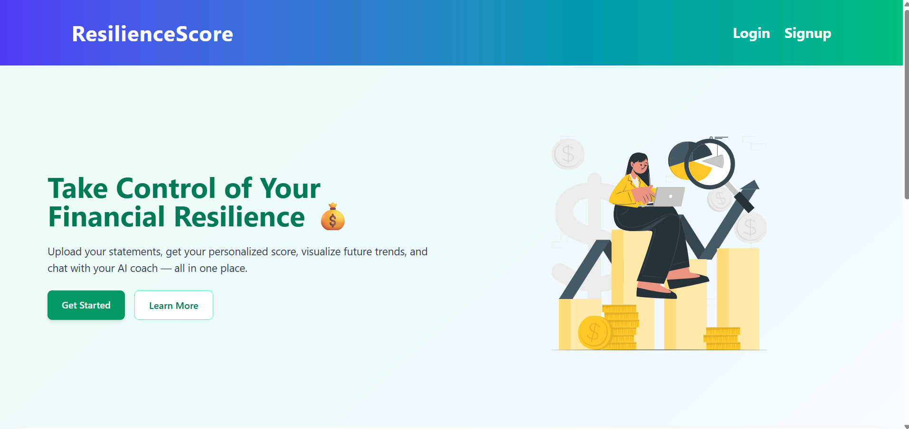
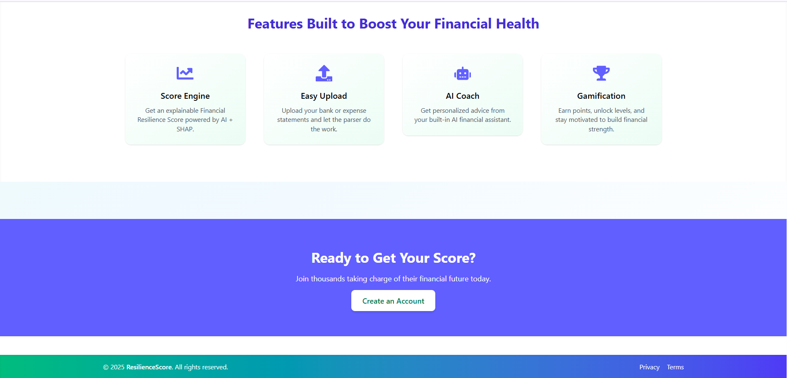
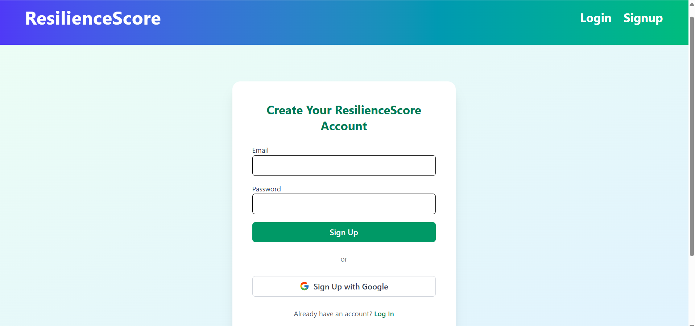
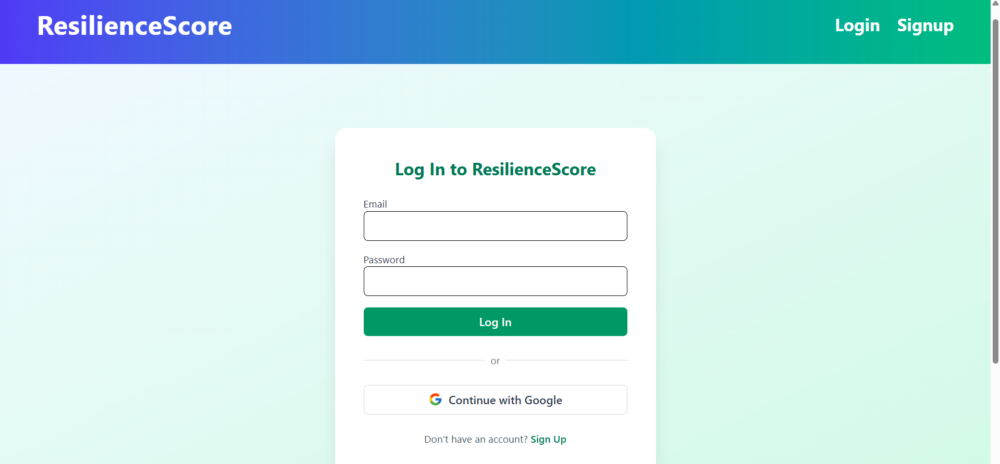
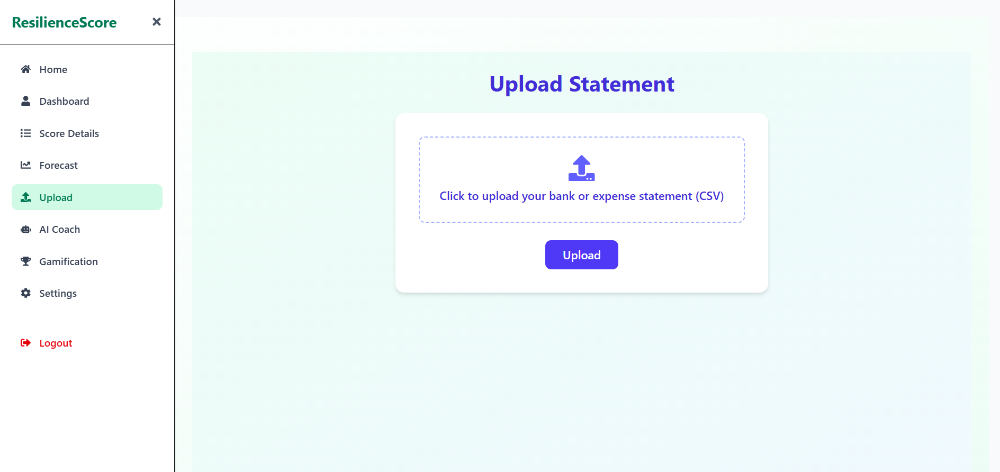
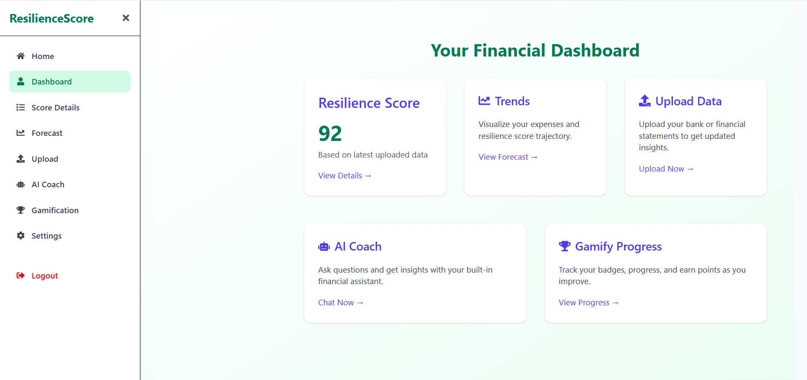
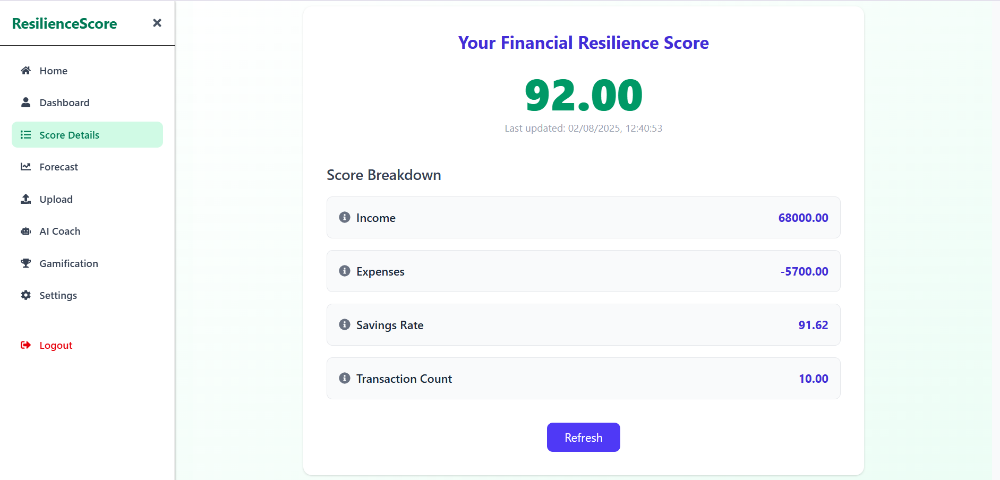
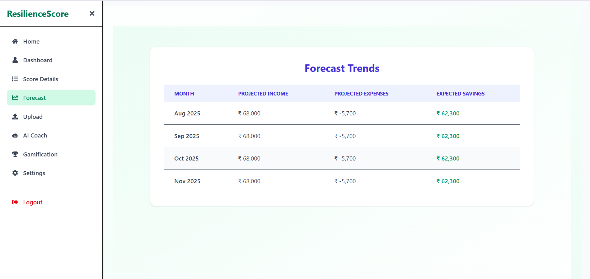
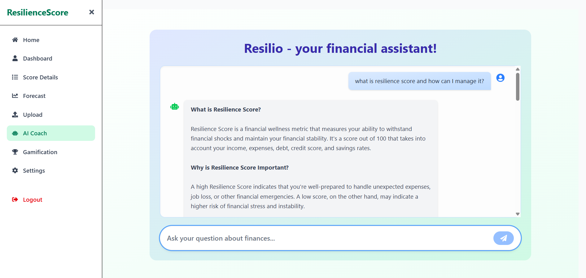
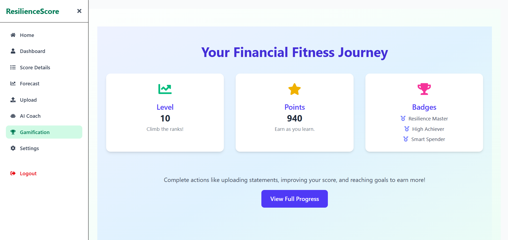

# Resilience Score

**Resilience Score** is a full-stack AI-powered web application designed to assess and enhance an individual’s financial resilience. Users can securely upload their financial statements, receive a detailed resilience score, view personalized insights, track their progress over time, engage in gamified experiences, and consult with an AI chatbot named **Resilio**.

---

## Problem Statement

Managing personal finances can be overwhelming due to a lack of personalized, insightful, and easy-to-understand tools. Traditional budgeting apps don’t quantify **financial resilience**—a person’s ability to withstand financial shocks. Users need a way to **analyze**, **score**, and **improve** their financial health with clarity, accuracy, and interactivity.

---

## Solution Overview

The **Resilience Score** platform addresses this gap by:

- Parsing uploaded statements (CSV).
- Automatically categorizing transactions.
- Calculating a comprehensive **Financial Resilience Score** based on income stability, expenses, savings, and emergency fund capacity.
- Providing a **dashboard**, **score details**, **forecast trends**, **gamified metrics**, and a **personal financial AI assistant** named Resilio.

---

## Key Features

- **Secure Auth with Supabase**
- **File Upload (CSV)** with instant parsing
- **Real-Time Score Calculation**
- **Trend Forecasts and Historical Progress Charts**
- **AI Chatbot Resilio** (via Groq API)
- **Gamification**: Points, Badges, Levels
- **User Settings**
- **Supabase Integration** for user, transaction, and score management
- **Private Routes** and session persistence

---

## Resilience Score Calculation

The **score is a composite metric (0–100)** based on:

- Income vs Expenses
- Savings rate
- Emergency buffer (savings/income ratio)
- Spending patterns and transaction categories

Each factor contributes to a weighted breakdown, which is stored in Supabase and shown in the dashboard.

---

## Score Details & Breakdown

- Calculates a Resilience Score (0–100) based on savings, spending, income, and debt
- Stores latest score with JSON-based breakdown in Supabase
- Uses historical score entries from Supabase
- Users can track resilience improvements over weeks/months
- Helps identify areas for targeted action

---

## Forecast & Full Progress Chart

- Uses historical score entries from Supabase
- Plots a time-series line chart using _recharts_
- Users can **track resilience improvements** over weeks/months
- Helps identify areas for targeted action

---

## Resilio – AI Chatbot

**Resilio** is an embedded AI assistant powered by the **Groq API**. It helps users:

- Understand their financial score
- Suggest ways to improve
- Answer general finance-related questions
- Offer insights on budgeting, debt, and saving strategies

Chat logic is handled in FastAPI (_chatbot.py_) and connects to Groq via _POST_ requests.

---

## Gamification

- Implements a dynamic point and level system with no persistent gamification table
- Points are awarded for uploads, score improvements, and financial discipline
- Levels increase with cumulative point milestones
- Badges unlock for consistent behavior (e.g., regular uploads, high scores)
- Enhances engagement by turning finance tracking into a rewarding experience

---

## 🧠 Technologies Used

### Frontend (React + Vite)

- **React 19**
- **Vite**
- **TailwindCSS** for UI styling
- **React Router v7**
- **Supabase JS SDK**
- **Recharts** for progress visualization
- **React Hot Toast** for notifications
- **React Dropzone** for file uploads
- **Axios** for HTTP requests
- **Date-FNS** for formatting
- **React Icons**

### Backend (FastAPI)

- **FastAPI** (Starlette + Pydantic)
- **pandas** for CSV parsing
- **Numpy** for numeric operations
- **Supabase Postgres DB** (via `psycopg2`)
- **Groq API** for chatbot
- **Categorizer** using regex and keyword mapping
- **CORS + Starlette middleware**
- **Uvicorn** for local dev server

---

## Supabase Usage

- **Authentication**: Signup, Login, Session
- **Tables**:
  - _users:_ Auth + metadata
  - _transactions:_ Parsed and categorized transaction data
  - _scores:_ Stores latest score, breakdown, timestamp
  - _settings:_ Data about app preferences
- **Realtime fetching** for dashboard and history
- Supabase handles:
  - Role-based access
  - Row-level security
  - Auto-generated APIs
- Client-side uses Supabase JS SDK to fetch scores

---

## Project Structure

```
Financial-Resilience-Score-System/
│
├── client/
│   |──src
│   │   |── assets/
│   │   ├── pages/
│   │   ├── components/
│   │   ├── layouts/
│   │   ├── lib/
│   │   ├── App.jsx, main.jsx
|   |── .env
│── common/
├── server/
│   ├── app/
│   │   ├── api/
│   │   ├── db/
│   │   ├── models/
│   │   ├── services/
│   │   ├── utils/
│   │   └── main.py
│   └── .env
│   └── requirements.txt
│
└── README.md
```

---

## Workflow




1. **User signs up or logs in** (Supabase auth)




2. **Uploads** a financial statement (CSV)



3. File sent to FastAPI _/upload_ endpoint

4. Parsed, categorized, and transactions inserted into Supabase
5. Resilience Score is calculated and inserted into _scores_ table
6. **Dashboard** shows live score, breakdown, and trends





7. **User chats with Resilio** (Groq-powered assistant)



8. **Gamification** and progress graphs update accordingly



---

## Future Enhancements

- In-app financial goal setting
- PDF/CSV auto-import from email or bank APIs
- Visualization of spending by category
- Multilingual support

---

## Contributors

- Pintu Kumar
- Kaushikee Kashyap
